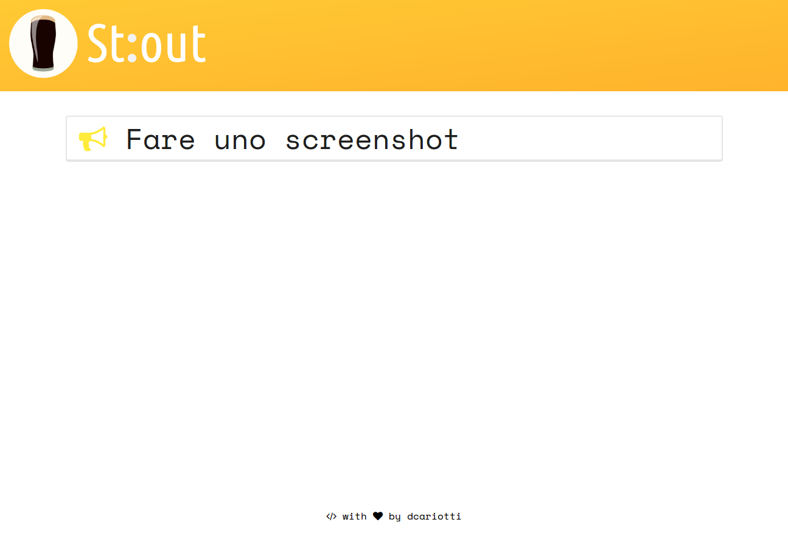
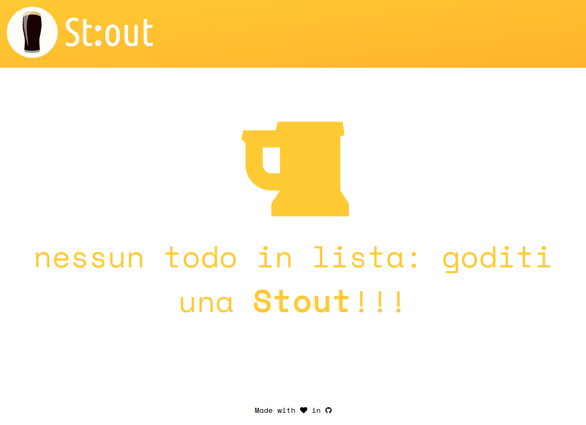

> Stout è distribuito sotto licenza MIT e pertanto è possibile farne il fork, modificarlo e distribuirlo nuovamente.
La lista dei comandi è disponibile su https://github.com/dcariotti/Stout.
Scrivere info [cmd] per avere più informazioni su un comando.

Stout è un software che tramite linea di comando, e seguendo degli appositi comandi, permette di modificare la lista dei todo (cose da fare) ed eliminarli una volta fatti.

Prima di poter utilizzare Stout, bisogna installare Python3 e Flask:
```bash
sudo apt install python3
sudo pip install Flask
```

### web.py

[](https://www.codacy.com/app/dunkerC/Stout?utm_source=github.com&utm_medium=referral&utm_content=dcariotti/Stout&utm_campaign=badger)

Il software dispone di un client per il web in modo da visualizzare la lista dei todo in modo più comodo. _Necessita dell'installazione del microframework Flask_. Per avviarlo:

```bash
cd lib
FLASK_APP=web.py flask run --port=8080
```

### app.py

Il programma da terminale si trova sempre nella cartella lib:
```bash
cd lib
python3 app.py
```

## Esempio funzionamento

```bash
> (🍺 ) (santo) info add
Inserisce un nuovo todo: ogni carattere dopo add sarà considerato tale
> (🍺 ) (santo) get ctodo
2
> (🍺 ) (santo) get todo
| 0 |	 Finire la documentazione e poi inserirla su GitHub
| 1 |	 Postare tutto su Sciax2 nella sezione Progetti Rilasciati
> (🍺 ) (santo) add Andare a comprare una RedBull
Ok
> (🍺 ) (santo) get todo
| 0 |	 Finire la documentazione e poi inserirla su GitHub
| 1 |	 Postare tutto su Sciax2 nella sezione Progetti Rilasciati
| 2 |	 Andare a comprare una RedBull
> (🍺 ) (santo) del 0
Ok
> (🍺 ) (santo) get todo
| 0 |	 Postare tutto su Sciax2 nella sezione Progetti Rilasciati
| 1 |	 Andare a comprare una RedBull
> (🍺 ) (santo)
```

## Screenshots



